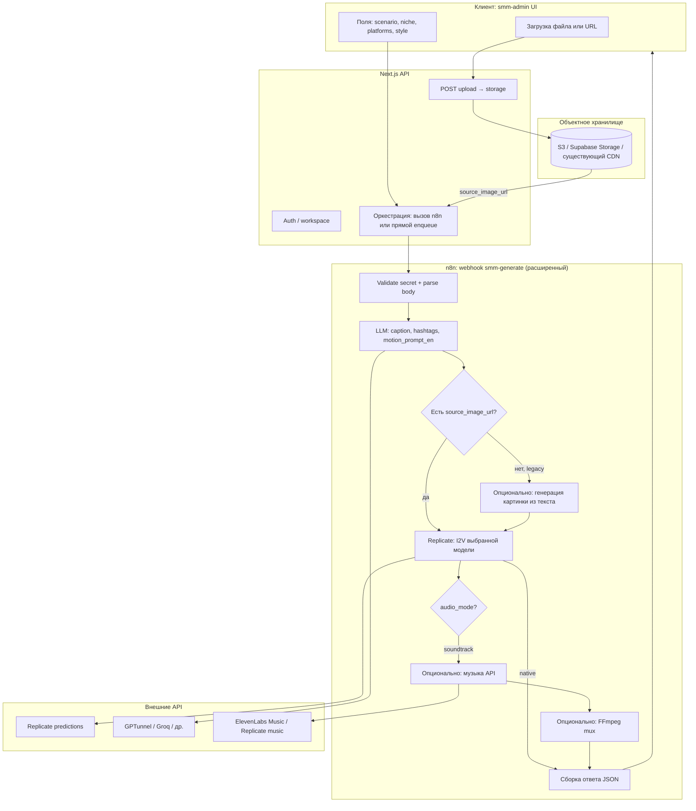
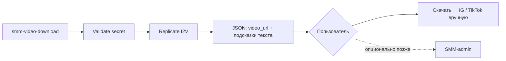

# Архитектура: видео для поста из изображения + сценарий (SMM Morrowlab)

Документ фиксирует **целевую архитектуру** пайплайна: пользователь загружает **любое стартовое изображение** (в т.ч. рендер), описывает **сценарий движения/атмосферы**, получает **готовое видео** (опционально с музыкой) и текст поста. Согласуется с текущим направлением **Next.js `smm-admin` + n8n + Replicate** (и существующим webhook `smm-generate`).

---

## 1. Цели и границы

### Цели

- **Вход**: публичный URL стартового кадра (`source_image_url`) *или* файл, загруженный в хранилище с получением URL; текст **`scenario`** (сценарий); контекст **ниши**, **платформ**, **стиля/настроения**.
- **Выход**: URL финального видео (`media_url`, `media_type: "video"`), подпись и хэштеги; опционально отдельный URL аудио или только «вшитый» звук в видео.
- **Качество**: приоритет **image-to-video (I2V)** моделей уровня Kling / Veo / аналоги на Replicate, а не устаревший чистый SVD как единственный вариант.
- **Универсальность**: стартовый кадр — **любое допустимое изображение** (рендер, фото, сток); продукт не привязан только к рендерам Morrow Lab.

### Вне скоупа (пока)

- Автоматическая модерация контента уровня enterprise (можно заложить хуки).
- Собственный GPU-инференс (всё через облачные API / Replicate).
- Гарантия «трендового трека как в TikTok» без отдельного шага музыки (см. раздел про аудио).

---

## 2. Термины

| Термин | Значение |
|--------|----------|
| **Стартовый кадр** | Одно изображение (JPEG/PNG/WebP), по URL, передаётся в I2V. |
| **Сценарий (`scenario`) | Пользовательский текст: камера, свет, темп, что подчеркнуть (на русском или EN — на усмотрение UI). |
| **Motion prompt** | Короткий **английский** промпт для I2V, собранный LLM из `scenario` + ниши + платформы. |
| **Native audio** | Звук, сгенерированный **внутри** видео-модели (эмбиент, SFX, иногда речь). |
| **Soundtrack** | Отдельно сгенерированная **музыка** (например ElevenLabs / Replicate), склейка с видео через mux. |

---

## 3. Высокоуровневая схема



### 3.1 Отдельная цепочка n8n: «только видео → скачать»

Принятое продуктовое решение: **не смешивать** сценарий «получить ролик и уйти в Instagram/TikTok руками» с цепочкой **обязательного** постинга через SMM-админку.

| Аспект | Решение |
|--------|---------|
| **Workflow** | Отдельный файл **`n8n_video_download_workflow.json`**, webhook path **`smm-video-download`** (не `smm-generate`). |
| **Авторизация** | Для этого потока **не требуется** вход в `smm-admin`: достаточно вызова webhook с секретом **с вашего бэкенда** или из доверенной формы (секрет не в браузере). |
| **Выход** | JSON с **`video_url`**, опционально `caption_suggestion` / `hashtags_suggestion`, флаг **`publish_required: false`**, текст **`notice`** про временность ссылки Replicate. |
| **Постинг** | Остаётся **опциональным**: пользователь скачивает файл и публикует сам; позже можно добавить кнопку «Открыть в админке» без изменения этой цепочки. |
| **Хранение у себя** | Текущий workflow **не пишет** видео на диск: только отдаёт URL. **Временное хранение** на вашем сервере / в bucket — отдельный шаг (узел после poll или Next.js после ответа): скачать по `video_url` → положить в storage → отдать **свой** URL + TTL и очистка. Подробности: [N8N_VIDEO_DOWNLOAD_WORKFLOW.md](./N8N_VIDEO_DOWNLOAD_WORKFLOW.md). |



**Ограничение текущей реализации в JSON:** узел Replicate использует **SVD img2vid** (как в старом `smm-generate`); поле **`motion_prompt_en`** от LLM возвращается для UI и для будущей замены модели на text+I2V (Kling / Veo и т.д.).

---

## 4. Компоненты и ответственность

| Компонент | Роль |
|-----------|------|
| **`smm-admin` UI** | Форма: загрузка/URL, сценарий, ниша, платформы, соотношение сторон, режим звука, пресет «тренд/спокойно». Отображение прогресса (polling или SSE — на этапе v2). |
| **Next.js API** | Аутентификация, **приём файла** → загрузка в storage → **публичный или подписанный URL** для n8n/Replicate; вызов n8n с телом запроса; опционально квоты по workspace. |
| **Объектное хранилище** | Хранение исходников и при необходимости финальных роликов (если не оставляем только URL от Replicate). |
| **n8n** | Единая точка оркестрации: секрет, ветвление «есть картинка / нет», LLM, вызовы Replicate, ожидание, опционально музыка + mux. |
| **Replicate** | I2V (и при legacy — T2V / старые модели). Версии моделей задаются явно (id версии или model slug по API). |
| **LLM** | Уже используется для caption/hashtags; **расширение**: генерация `motion_prompt_en` из `scenario` + контекста. |
| **Mux (FFmpeg)** | Отдельный worker/контейнер или n8n на машине с FFmpeg: `video + audio → один файл`. |

---

## 5. Потоки данных

### 5.1 Основной поток (целевой)

1. Пользователь загружает изображение **или** вставляет URL → приложение гарантирует **`source_image_url`** доступный для Replicate (прямой HTTP GET без auth или подписанный URL с достаточным TTL).
2. Пользователь заполняет **`scenario`**, опционально нишу/платформы/стиль.
3. API вызывает n8n с расширенным телом (см. §6).
4. n8n: LLM возвращает JSON с `caption`, `hashtags`, `motion_prompt_en`.
5. n8n: запуск prediction Replicate (I2V) с `image: source_image_url`, промпт = `motion_prompt_en`, параметры соотношения сторон и длительности по модели.
6. Poll до `succeeded` → `output` URL видео.
7. Если `audio_mode === "soundtrack"`: сгенерировать музыку, mux с видео, залить результат в storage (или отдать URL если mux на той же машине и отдаётся наружу).
8. Ответ клиенту: `media_url`, `media_type`, `caption`, `hashtags`, опционально `motion_prompt_en`, `video_model`.

### 5.2 Обратная совместимость (текущий workflow)

- Если **`source_image_url` отсутствует** и передан старый контракт (`type`, `style`, `niche`…): сохраняется ветка **GPT → картинка (HomeDesigns) → видео (SVD или замена на I2V)** как сейчас в `n8n_smm_generate_workflow.json`.
- Постепенно **SVD заменяется** на ту же I2V-модель с подставленной сгенерированной картинкой, чтобы не плодить две кодовые базы логики.

### 5.3 Ошибки и таймауты

- Replicate: лимит времени ожидания, N попыток poll, понятная ошибка пользователю.
- Невалидный URL картинки (403/404): валидация **до** вызова I2V (HEAD GET или probe node).
- Превышение квоты Replicate/аккаунта: маппинг в UI.

---

## 6. Контракт API (целевое расширение)

### 6.1 Запрос → n8n webhook `POST /webhook/smm-generate`

Заголовок: `X-SMM-Secret` (как сейчас).

Тело JSON (надмножество текущего):

```typescript
// Целевой контракт (эволюция GeneratePostInput)
interface GenerateMediaPostInput {
  // существующие
  niche: string;
  style: string;
  platforms: string[];       // instagram | tiktok | telegram | ...
  type: "image" | "video";
  projectId: string;
  trendKeywords?: string[];
  brandColors?: string[];
  extraInstructions?: string;

  // новые
  /** Публично доступный URL стартового кадра для I2V */
  source_image_url?: string;
  /** Пользовательский сценарий движения/атмосферы */
  scenario?: string;
  /** vertical | horizontal | square — маппится в параметры модели */
  aspect_preset?: "9:16" | "16:9" | "1:1";
  /** Режим звука финального файла */
  audio_mode?: "native" | "soundtrack" | "mute";
  /** Если audio_mode === soundtrack — краткое описание жанра/настроения музыки */
  music_prompt?: string;
  /** Логическое имя маршрута модели (см. конфиг n8n) */
  video_model_preset?: "quality" | "fast" | "budget";
}
```

Правила приоритета:

- Если задан **`source_image_url`** и `type === "video"` → **I2V** с этим изображением; поле `scenario` желательно; картинка из HomeDesigns для этого пути **не обязательна**.
- Если **`source_image_url` нет** и `type === "video"` → legacy: генерация изображения, затем видео.

### 6.2 Ответ

Расширение текущего `GeneratePostResult`:

```typescript
interface GenerateMediaPostResult {
  media_url: string;
  media_type: "image" | "video";
  caption: string;
  hashtags: string[];
  video_prompt?: string;           // legacy / или объединить с motion_prompt_en
  motion_prompt_en?: string;       // то, что ушло в I2V
  audio_mode?: "native" | "soundtrack" | "mute";
  video_model?: string;            // slug версии для поддержки/логов
}
```

---

## 7. Загрузка «любой картинки»

- **Клиент** отправляет `multipart/form-data` на **`/api/.../upload`** (новый route) или сначала грузит в Supabase Storage с клиента — политика CORS/RLS должна быть согласована.
- **Сервер** проверяет тип (image/*), размер, опционально разрешение; сохраняет в bucket; возвращает **`source_image_url`**.
- URL должен быть **читаем Replicate** в момент prediction (часто нужен **прямой HTTPS** без cookie-auth).

---

## 8. Стратегия моделей (Replicate)

Конкретные **version id** не фиксируем в этом документе — они меняются; в n8n хранится **таблица пресетов**.

| `video_model_preset` | Назначение | Кандидаты (slug на Replicate) |
|---------------------|------------|-------------------------------|
| `quality` | Максимум качества I2V + звук в композиции | `kwaivgi/kling-v3-video`, `google/veo-3.1`, `openai/sora-2` (проверка I2V на карточке) |
| `fast` | Быстрые итерации, соцсети | `xai/grok-imagine-video`, `google/veo-3.1-fast` |
| `budget` | Дешёвые прогоны / черновики | `minimax/hailuo-2.3`, `pixverse/pixverse-v5.6`, open Wan I2V |

Переключение модели — **конфигурация n8n + env**, без деплоя фронта.

---

## 9. Аудио

| Режим | Поведение |
|-------|-----------|
| `native` | Один вызов I2V; звук как даёт модель; **без** отдельного трека. |
| `soundtrack` | I2V с приглушением/без опоры на музыку модели + **ElevenLabs / Replicate music** + **FFmpeg** `-c:v copy -c:a aac` (или перекодирование по политике). |
| `mute` | Принудительно без звука или удаление аудиодорожки для дальнейшей ручной кладки в редакторе. |

**Важно:** «трендовая музыка» в юридическом смысле часто = **лицензия**; сгенерированный трек проще обосновать в коммерческом посте, чем нарезка чужих хитов.

---

## 10. Безопасность и соответствие

- Секрет webhook только сервер-сервер; **не** светить в браузере.
- Пользовательское изображение: **заявление о правах** в UI; опционально логирование hash для злоупотреблений.
- Лимиты по workspace (кол-во видео/день) в БД Supabase.
- Хранение URL и метаданных поста — по существующей схеме `content`.

---

## 11. Связь с кодом репозитория (текущее состояние)

- Клиент n8n: `smm-admin/src/lib/n8n.ts` — интерфейсы `GeneratePostInput` / `GeneratePostResult` **расширить** под §6 после реализации workflow.
- Эталон workflow (устаревающий под новый I2V): `smm-admin/n8n_smm_generate_workflow.json` — ветка **HomeDesigns + SVD** → заменить/параллелить с **I2V по `source_image_url`**.
- **Отдельно:** `smm-admin/n8n_video_download_workflow.json` + инструкция [N8N_VIDEO_DOWNLOAD_WORKFLOW.md](./N8N_VIDEO_DOWNLOAD_WORKFLOW.md) — сценарий **только скачивание**, без постинга.

---

## 12. Фазы внедрения

| Фаза | Содержание |
|------|------------|
| **MVP** | Импорт **`n8n_video_download_workflow.json`**, вызов **`smm-video-download`** с `source_image_url` + `scenario`; ответ с `video_url` и `publish_required: false`. Опционально: прокси-загрузка файла на свой storage. |
| **MVP+** | Загрузка/URL → `source_image_url`; единый или расширенный `smm-generate`: LLM `motion_prompt_en` + пресет I2V (`quality` или `fast`); `audio_mode: native`; ответ как сейчас + `motion_prompt_en`. |
| **v1.1** | Пресеты `video_model_preset`; улучшенные ошибки и таймауты. |
| **v2** | `soundtrack` + mux worker; прогресс в UI (poll job id); сохранение финального файла в свой bucket. |

---

## 13. Решения, которые нужно зафиксировать перед реализацией

1. **Где хранить загрузки** (Supabase Storage vs существующий Filestack/другое).
2. **Синхронный vs асинхронный** ответ webhook n8n (длинные видео могут требовать job + callback).
3. **Один** основной I2V для MVP (например Kling v3 **или** Veo 3.1) — по бюджету и доступности API на Replicate.

---

*Документ можно обновлять по мере смены моделей и политик Replicate; бизнес-логика и границы компонентов должны оставаться стабильными.*
